# Learning AWS

## Global infrasctructure
We can separate the AWS Infrastructure in regions, and inside the region, in availability zones. All availability zone is a kind of `Data Center`. For example, São Paulo is one of this regions, in we have 3 availability zones inside São Paulo's region. (july 2021)

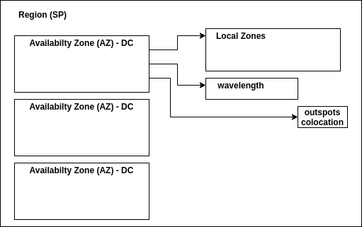

More info about this [here.](https://aws.amazon.com/about-aws/global-infrastructure/?nc1=h_ls)

## Account
We need a credit card to create account. We can create and confirm. To increase your security, active Two-factor Authenticator.

### 2FA
To add Two factor authenticator, you can cick on your name on the right top of the screen, `My Security Credentials`
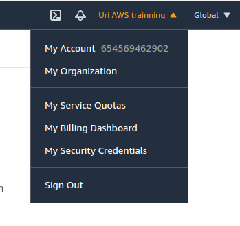

After this click on `Active MFA`:
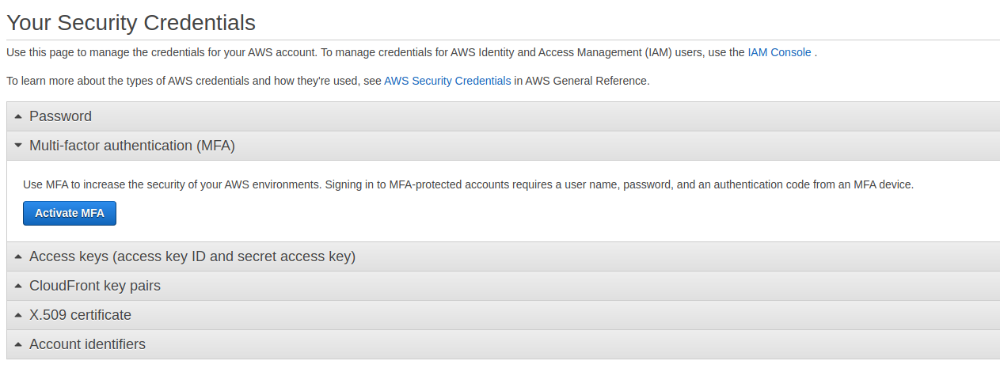

Select `Virtual MFA device`:
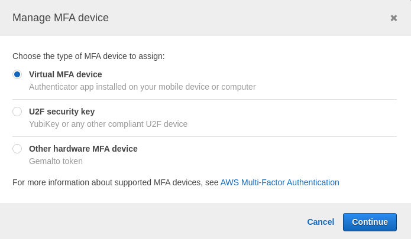

And finally, scan with your favorite app and add two consecutive numbers:
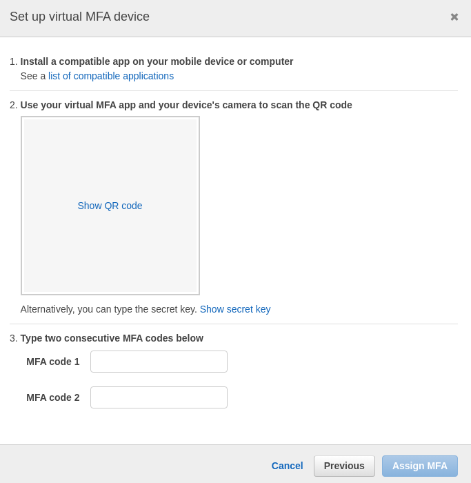

Your account now is more secure.

### Billing alerts
Sometimes happens shit and any service can be running without our control and can produce a big payment account at the end of the month. To avoid this, we can create an alert of billing. 

To do this, you can cick on your name on the right top of the screen, `My Billing Dashboard`:

Go to `Billing Preferences` and check for `Receive Billing Alerts`. After this, you need to save preferences:
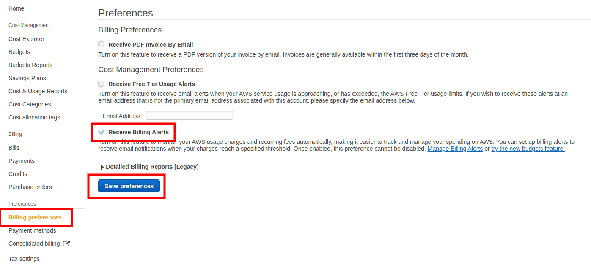

After this, we can click on `Manage Billing Alerts` to go to configure it on **CloudWatch**. Click on `Billing` on left menu inside `Alerts` and click on button `Create Alert`.
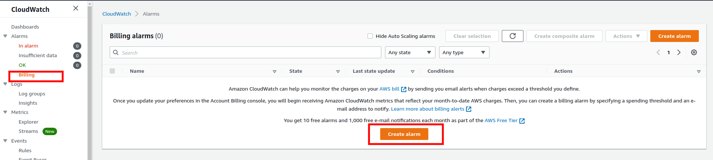

Especify the threshold. For example, 5 dolars. After this, click `next`:
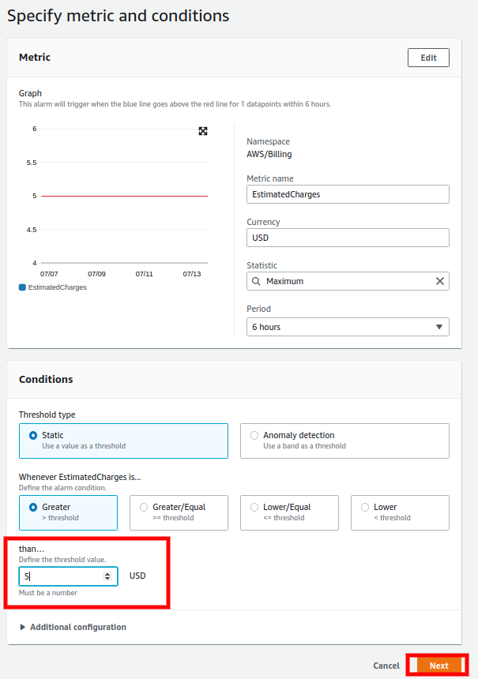

To configure the notification, we need to create a new SNS topic. Especify the name and add a list of emails to send the notifications alerts. After fill this fields, click on `Create topic`, and click on next after this.
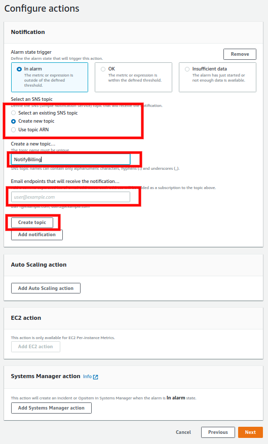

Fill the alarm name and the alarm description and click on next.
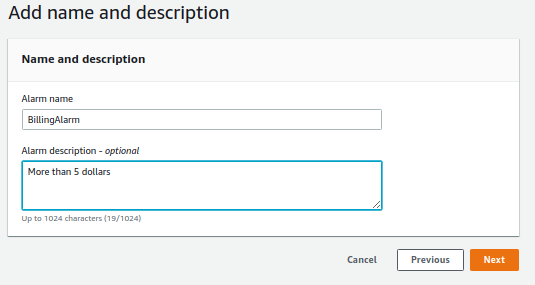

After this, we see a resume page and click to finalize. The alarm is created. On the top of the list appear a message telling us that some recipients does not confirm the subscription.
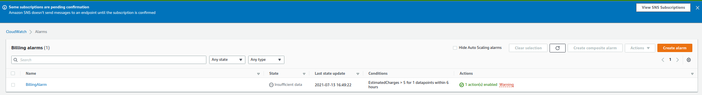

Go to the inbox email and confirm clicking on the link.
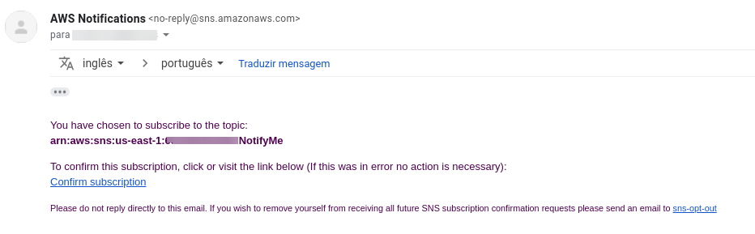

Now, we will receive notifications when the billing increase more than 5 dollars.

---
## References
- https://www.udemy.com/course/certificacao-amazon-aws-2019-solutions-architect
- https://aws.amazon.com/free