# Learning AWS

## Global infrasctructure
We can separate the AWS Infrastructure in regions, and inside the region, in availability zones. All availability zone is a kind of `Data Center`. For example, São Paulo is one of this regions, in we have 3 availability zones inside São Paulo's region. (july 2021)


More info about this [here.](https://aws.amazon.com/about-aws/global-infrastructure/?nc1=h_ls)

## Account
We need a credit card to create account. We can create and confirm. To increase your security, active Two-factor Authenticator.

### 2FA
To add Two factor authenticator, you can cick on your name on the right top of the screen, `My Security Credentials`


After this click on `Active MFA`:


Select `Virtual MFA device`:


And finally, scan with your favorite app and add two consecutive numbers:


Your account now is more secure.

### Billing alerts
Sometimes happens shit and any service can be running without our control and can produce a big payment account at the end of the month. To avoid this, we can create an alert of billing. 

To do this, you can cick on your name on the right top of the screen, `My Billing Dashboard`:


Go to `Billing Preferences` and check for `Receive Billing Alerts`. After this, you need to save preferences:


After this, we can click on `Manage Billing Alerts` to go to configure it on **CloudWatch**. Click on `Billing` on left menu inside `Alerts` and click on button `Create Alert`.


Especify the threshold. For example, 5 dolars. After this, click `next`:


To configure the notification, we need to create a new SNS topic. Especify the name and add a list of emails to send the notifications alerts. After fill this fields, click on `Create topic`, and click on next after this.


Fill the alarm name and the alarm description and click on next.


After this, we see a resume page and click to finalize. The alarm is created. On the top of the list appear a message telling us that some recipients does not confirm the subscription.


Go to the inbox email and confirm clicking on the link.


Now, we will receive notifications when the billing increase more than 5 dollars.

We can create categories, for separete by service or tags, clicking cost categories inside `Billing dashboard`:


Select options, for example service EC2 and Create Cost Category:


We can see our category and explore it:


### Budget
We can do the same configuring a budget

### Cloudtrail
Cloudtrail is different than Cloudwatch. Cloudtrail is focused on monitoring actions, like who create a bucket, or command executed on CLI.

## AIM
The account user is called root user. We can create other users, and group it by permissions. All the information about IAM we can find on [here](https://console.aws.amazon.com/iam/home) or selecting from Services pages:


### Creating groups
To access to groups, click on `User groups`. After this, click on the button `create group`.


Select a name (without spaces), choose policy/policies, and click on button `create group`.


If we open a group and go to the `Permissions` tab, we can see the policies of the group. We can click on any policy and go to the detail policy:


On policy, we can see the details of the policy and as Json format:


### Users
Two types of users for acces type:
- Access by console
- Access by API: Access key and Secret key.

On the left menu, we can go to users page, or go direct click [here](https://console.aws.amazon.com/iamv2/home#/users). Click `Add users` button.

The next page, we can especify user name (without spaces), access type and password (if select _console access_), and click on `next`: 


After this, select a group (you can copy permissions for other user or create new permissions too):


Set tags if you want and create user:


On resume page, we can see a link direct to our "corporation" console, to login directly:


- _note_: After create a Programatic access user, on resume page, copy access key and secret key, because is not possible get again after leave this page. For console access, we can reset the password, but we can not get again after leave the page.

### Policy password

We can apply policies for password. Go to `Account settings` inside IAM page, and click on button `Change password policy`:


The next options are available for password policy:


## AWS Cli
The AWS Command Line Interface (CLI) is a unified tool to manage your AWS services. With just one tool to download and configure, you can control multiple AWS services from the command line and automate them through scripts.

### Install
We can follow the instructions from [AWS Cli site](https://docs.aws.amazon.com/cli/latest/userguide/install-cliv2-linux.html#cliv2-linux-install)

```shell
curl "https://awscli.amazonaws.com/awscli-exe-linux-x86_64.zip" -o "awscliv2.zip"
unzip awscliv2.zip
sudo ./aws/install
```

We can see version with command `aws --version`

### Configure
First of all, we need to create a user kind Access by API. See the user creation section.

After this, we can run command:
```shell
aws configure
```
We need three informations:
- Access key
- Secret key
- Default region - we can digit `us-east-1`
- Default output format - we can digit text, json or table

After this, we can see the configure profile runing command `aws configure list`.

### Usage

Today, a good practice is use a linux EC2 instance to conect to AWS Cli.

## S3
Amazon Simple Storage Service [Amazon S3](https://aws.amazon.com/s3/?nc1=h_ls) is an object storage service that offers industry-leading scalability, data availability, security, and performance.  

AWS offers 5 different types:
1. **S3 Standard**: for general-purpose storage of frequently accessed data; 
2. **S3 Intelligent-Tiering**: for data with unknown or changing access patterns; 
3. **S3 Standard-Infrequent Access (S3 Standard-IA)** for long-lived, but less frequently accessed data;
4. **S3 One Zone-Infrequent Access (S3 One Zone-IA)** for long-lived, but less frequently accessed data; 
5. **Amazon S3 Glacier (S3 Glacier)** for long-term archive and digital preservation. 
6. **Amazon S3 Glacier Deep Archive (S3 Glacier Deep Archive)** for long-term archive and digital preservation. 


the cost decreases for the top to the bottom.

To see the pricing, go to [the S3 pricing page](https://aws.amazon.com/s3/pricing/?nc=sn&loc=4)

You can also access to [the S3 calculator page](https://calculator.aws/#/createCalculator/S3)

_note_: Max size file: 5 Terabytes

### Creating a bucket
The bucket site is global, is not especific for a region. So, when we enter on bucket site on the top of the page we can see `Global` as selected Region.

We can create a bucket clicking on the button:


We need to create an unique name in the world, because this name will be used as a DNS. We need here to select the region of this especific bucket, and we can copy settings from existing buckets:


After create the bucket, it appears on the list:


We can upload something click on `upload`, inside the bucket details:


We can add files and click on update:


(Before update we can select in properties, the kind of storage)


On the summary, we can see de ARN (Amazon Resource Name) and the object URL, that use the unique name of bucket.

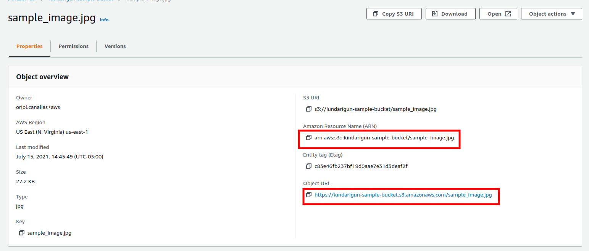

We can change the storage class for an object, but all changes can produce cost, because you are moving objects between zones.

### Permissions
By default, buckets do not permit allow accesses. You can see here:


We can change it and uncheck `Block all public access`. But this only allow apply ACL policies, but we do not configure anything.

Go to the object uploaded, on permissions, and we can see the ACL configuration. Click on edit:


On the next page, we can check for `Everyone` read, accept the disclamer and save the changes.

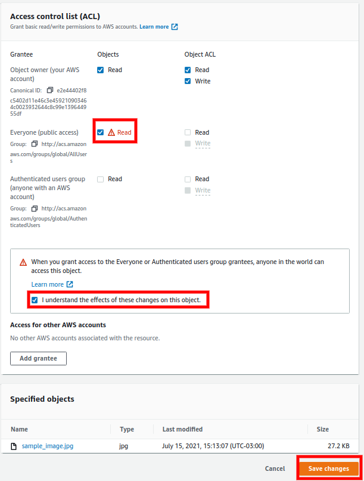

The object url must be work! 
- _note_: To give write permissions, we must to use API or AWS Cli

### Versioning
We can allow versioning for an especific bucket. Consider that all versions of the same file "consume" space on the bucket, you pay for all versions, because for S3 we have 10 files, no 1 file with 10 versions. If we delete the file, we already have the 10 version. We can restore "deleting" the last version with type `Delete marker`.

### Lifecycle
We can configure policies for the objects, like expire old versions (if versioning is active), move between storages, and so on.

Inside a bucket we can click on `Management` tab. 


And we can `create lifecycle rule` clicking on button:


We can configure some actions on `Lifecycle rule actions`, to delete, move between storages classes, etc.


### Replication
We can create a new bucket in an other Region to contains replication data from other bucket.

To enable replication, we can create a new replication rule, acessing on `Management` tab, inside the origin bucket.


If we not enabled the versioning for the origin bucket, this advertise will be show and we will need to enable it.


After this, we can create a name for the rule, and we can decided if we will replicate all objects on bucket or only a few elements filtering by tag or regex.


We choose the destination bucket and mark to create new IAM role:


And we choose a data class storge, perhaps to save money with the replication bucket:


The replication does not happens for existing objects, but we can force it using CLI.

_note_: Delete is out of replication, so if we delete objects on origin bucket, the same object **is not deleted** on the replication bucket.

### Using CLI to copying existing objects
First of all, we can list all buckets with the instruction `aws s3 ls`.

For copy the files we can use the command `aws s3 cp --recursive s3//<bucket origin> s3://<bucket destiny>`

```
$ aws s3 cp --recursive s3://iundarigun-sample-bucket s3://iundarigun-sample-bucket-backup
```

### Storage Gateway

We can install a software on our on-premise datacenter to replicate some data to S3. For this we have three types of storage:
- File gateway: Pictures, videos, pdfs, etc. NFS
- Volume gateway: Operations, vmware, etc. ISCSI
- Tape gateway: Backups. Glacier

If this software is not enough, you can use `SnowBall`. More information [here](https://aws.amazon.com/snowball/?nc1=h_ls&whats-new-cards.sort-by=item.additionalFields.postDateTime&whats-new-cards.sort-order=desc)

### Adding a site
We can use S3 to storage a site. For this, we create a new bucket without permission restrictions.

After this, we can configure the bucket as a website storage. Go to properties:


Scroll the page and click on Edit button on `Static website hosting` section:


Mark as `Enable` and especify the index and the error document. Click on save:


After this, we can get the url on the view of the section:


After this, we can upload the files.

## CloudFront and CDN
CloudFront is a fast content delivery network (CDN) service that securely delivers data, videos, applications, and APIs to customers globally

CDN replicate data to put objects in Availability zones near to request zone. It is a kind of cache. We use CDN for static elements on a web site.

### Creating CloudFront
First of all, create a bucket, and add public video. In my case, the video is in this url: https://iundarigun-cdn-bucket.s3.amazonaws.com/sample.mp4

To do this, we need to create a `cloudFront distribution`. If you enter on CloudFront Service at first time, perhaps your screen is like this:


If you have play with it before, you can click directly on `Create Distribution` button on distributions section.


For the origin, we choose the bucket and enter a name:


We can choose the storage class, considering the cost:


And we can enable the access logs, choosing a bucket and a log prefix name.


After create, this action may take a few minutes:

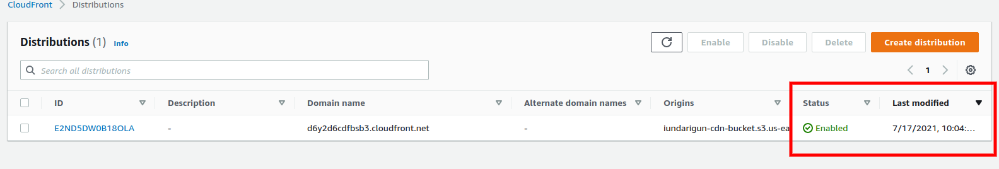

Now, we can use de domain name to access to the video.

### S3 Transfer acceleration

It is the revers CDN. It happens to upload files to S3 and use the Cloudfront architecture to do it local and replicate to others regions.

To do this, you can open a bucket, go to properties:


scroll down the page and click on edit  on `Transfer acceleration` section: 


Click on `Enable`. We have a new endpoint to do upload:


## EC2
Elastic Compute Cloud (EC2) is a web service that provides secure, resizable compute capacity in the cloud.

We have some price plannings:
- On-demand: You pay for compute capacity by the hour or the second depending on which instances you run.
- Reserved instances or saving plans: is used by contract, and can be 75% less than on-demand price.
- Spot instances: used for get less prices on-demand
- Dedicated host: physical server. Can be used to reused server licences

### Understanding kinds of instances
Prefix names on EC2 instances:
- C: Compute optimazed
- G: Graphics. Better video card.
- D: Dense storage
- R: Memory optimaze
- M: General
- I: High speed storage - Database
- F: For programming purpose
- T: Webservers
- P: GPU - machine learning
- X: Memory 

### Volumes
EBS: Elastic block storage, is a virtual disk. To mesure the performance of the volume, Amazon use IOPS, input/output operations per second. Some kinds of EBS:
- GP2: General purpose SSD. Good price. 3.000 to 10.000 IOPS
- Provisioned SSD (IO1): high intensitive - Database. 10.000 to 20.000 IOPS
- ST1 (HDD): Data, log, backup. No boot (no OS)
- SC1 Cold HDD: Like ST1, more chiper, infrequent access
- Magnetic (Standard): HDD for infrequent access but accept boot.

### Creating an EC2

Step by step, we can create a new instance, for example windows server. We need to go to EC2 service site and click on `Launch instance` button:


We can see that exists 7 steps:


Choose the AMI (Amazon Machine Image). We can filter by free tier only and select the desire machine:


Select kind of instance type:


We can configure some details about instances, like number of instances, network, and so on


We can configure storage (EBS) and add more volumes if it is necessary


We can add also some tags, that we can use after:


We can create a new security group and choose some properties. After this we can launch:


The review page:


After run, we need to create some keys to access, do download and lanch the instance:


After this, instance is launch:


On list of instances, we can select our instance and connect it:

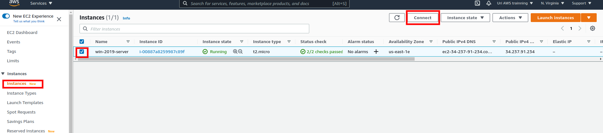

To connect using RDP, we need to generate a password. And for this, we need to use the downloaded key file previously:


After play, we can delete (`terminate`) our ec2:


And confirm delete:


### Creating web server linux instance

Create a new instance selecting Linux and configuring a new policy security:


After launch, we can connect it using ssh.

to connect, change access mode to pem file.
```terminal
$ sudo chmod 400 linuxwebserver.pem
```

And connect to using ssh:
```terminal
ssh -i linuxwebserver.pem ec2-user@<ec2-url>
```

To enable server, we can install and add the index.html:
```terminal
sudo su
yum install httpd
nano /var/wwww/html
service httpd start
```

Now, we can access it using our browser.

### Playing with volumes
When we create a new EC2 instance, we can do a couple of things with the volumes. For example, we can create a snapshot. Basically, it is a copy of the volume at the moment of the creation of snapshot.

We can go to volumes, select the volume and click on create snapshot:


We can give a name and finish it:


If we go to `Snapshots`, we can `create volume` or `create image` from this snapshot:


If we create a volume, we can change from Availability Zone, Size or Volume type:


_Note_: to move inter regions, not only Availability Zones, we need to copy the snapshot, on the previous image menu, option `copy`. 

If we want create an image, this image will be able to create new EC2 instances:


After create, we can see on `AMIs` section:


If we want launch a new EC2 instance we can find this new image on the list of selection:


### Adding monitoring
We can add monitoring to our EC2 instances. We can enable this on creation or after creation on tab `Monitoring`.

We can go to `Cloudwatch` and in `all alarms` menu, we can click on `create alarm` button. First of all we need to select the metric:


For EC2, select it:


Select `Per-instance Metrics`:

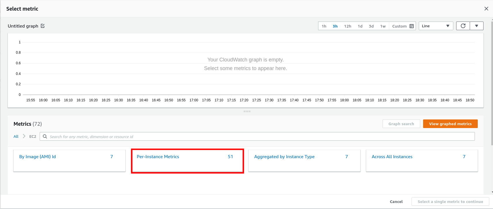

And select your instance and metric. In this case, CPU utilization:


Select the threshold:


And select SNS topic:


If the instance get more than 80% of CPU usage for a minute, we will received an email. 

### Using Roles to configure AWS Cli inside EC2 instance
A good practice is use an EC2 instance to run cli commands. But instead connect using a public key and private key, can be better create a role. 

For this, we can go `IAM` site and click on `Roles` menu. We click on `create role` button:


Select `EC2`:


Select the desired accesses:


And give a name and save:


On the instance, we can add without reboot a IAM Role:


And select the created role:


Now, connecting to the instance, we can run aws cli commands


### Bootstrap example
We can configure an EC2 instance to execute some tasks when create it, like update so, create something, etc

We will add some commands to test it. 
1. Update SO
2. install httpd and configure `index.html`
3. configure to start service when reboot
4. create a bucket
5. copy `index.html` into the bucket

For aim this, we create a new EC2 instance. The different parts are in `Step 3: Instance details`. We need to configure the `IAM Role`:


And we configure the bootstrap exec instructions:


The instructions in text:

```shell
#! /bin/bash
yum update -y
yum install httpd -y
service httpd start
chkconfig httpd on
cd /var/www/html
echo "<html><h1>site online</h1></html>" > index.html
aws s3 mb s3://iundarigun-bootstrap-bucket
aws s3 cp index.html s3://iundarigun-bootstrap-bucket
```

After this, we have a web server!

### EFS - Elastic File System
It is the solution to share volumes enter EC2 instances. This approach is not possible with standard volumes EBS.

### Load balancer 
Three kind of LB in AWS.
- Application Load Balancer: Http and Https
- Network Load Balancer: Network Layer (TCP)
- Classic Load Balancer (or elastic LB): is a legacy Load Balance -> Http/https/tcp

First of all, we need to create a `target group`:


Choose a name for this target and instances:

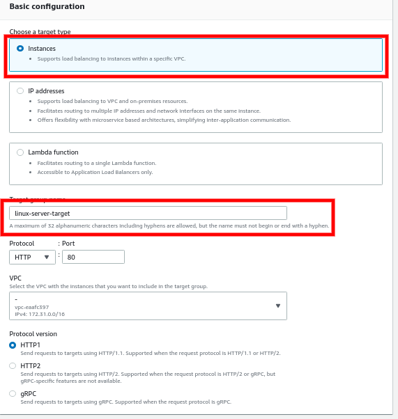

And especify the healths:


After this, we add instances to target group and click on create:


After this, we create a load balancer:


Select Http/Https type:

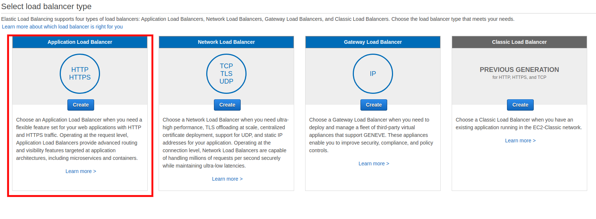

Type a name and select at least two availability zones:


This advertice is because we doens't select https 


Select a security group:


And select the target group create previously:


After this we can finish and click on create button:

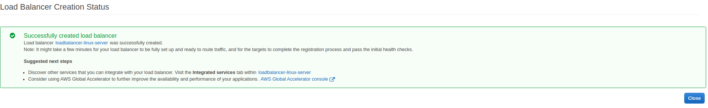

The Load balancer can delay a couple of minutes to finish and after this we can use a public url:


### Metadata

Metadata is information that EC2 instance can give to you about it. Information like public ip, security groups, hostname and so on. To access to this information without login on AWS console, we can get it using curl and a standard url: `curl http://169.254.169.254/latest/meta-data`. This curl returns a list of available informations:


If we want any information, we can invoke the same url with the desire information at the end of the url:


### Autoscaling

We can create policies to autoscaling EC2 instances, to able more or less capacity depends on metrics. 

First of all, we need to create a `Launch configuration`. Go to the site page on EC2, and click on `create Launch configuration` button: 


Give a name and select the AMI and instance type:


Configure the startup script of the machines:


And select the security group:


After this we can create the launch configuration: 


Now, we need to create an `Auto scaling group`:


Give a nane and click on `switch to launch configuration`:


Select the configuration create before and next:


Select subnets to garantee the servers will be creates on differents availability zones:


Choose time to do health check:


And select the policy to autoscaling, and finish configuration:


We can see the instances created by Scaling group:


When we top the server CPUs, the scaling policy add more machines. And when the CPU average downs less than threshold, scaling policy decrease the number of instances.

## Database

- Relational databases:
    - Multi availability zone: Disaster recovery
    - Read replica: copy database to read
    - Aurora is an Amazon solution. Faster than other solutions, and chipper than other solutions. It is compatible with MySql and Postgres.


- No SQL (DynamoDB):
    - document-oriented or key-value
    - SSD and 3 datacenters
    - configurable for consistent reads (acceptingh delays more than second to get new reads) or for strongly consistent reads (less than a second)

- ElastiCache:
    - Faster, scalability. It is an in-memory cache system.
    - Two types: Memcached (objects) and Redis (Key-values and multi AZ)

- Redshift:
    - Is a warehouse solution for big data
    - Single node or compute node (128 instances)
    - It is not multi AZ

### Creating Relational Database (RDS)

To create a relational database, we must to access a RDS page and click on `create database` button:


We choose MySQL (we doens't choose `Aurora` because we will create an Aurora later):


We choose `Free tier` template, choose a name to database, a username and a password:


We let selection of free tier machine:


We choose `No public access` on connectivity options:


And we choose a name to the database and create it:


If you go to details of database, we can get the url of database. We will use it to connect from EC2 instance


The important point is about security group. We leave the default security group to database, we need to add this group on EC2 instance.

### Backup
- Automated: 1 - 35 days - For seconds in S3. It is free.
- DB Snapshot: Manual

To able Multi-AZ we need to able automatic backup. After this we can click on `modify` button:

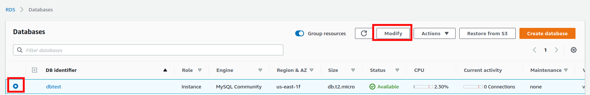

Select `Create a standby instance` for a multi-AZ deployment.


We have an advertice, and we can select a manteinance window to do it or apply immediatly:


To create a read replica, we can select the database ansd click actions, `create read replica` menu option:


Choose a name and a region and finish:


On database details we can see the two databases:


### Aurora

Creation of Aurora database is similar than RDS MySQL. Select `create database`, select Aurora and, por example, we can select Postgres compatibility. Select `Provisioned` too:


Especify the name of database, username and password, and the size of the machine:


Let security group default:


Select a name for database, select priority and click on `create database`:

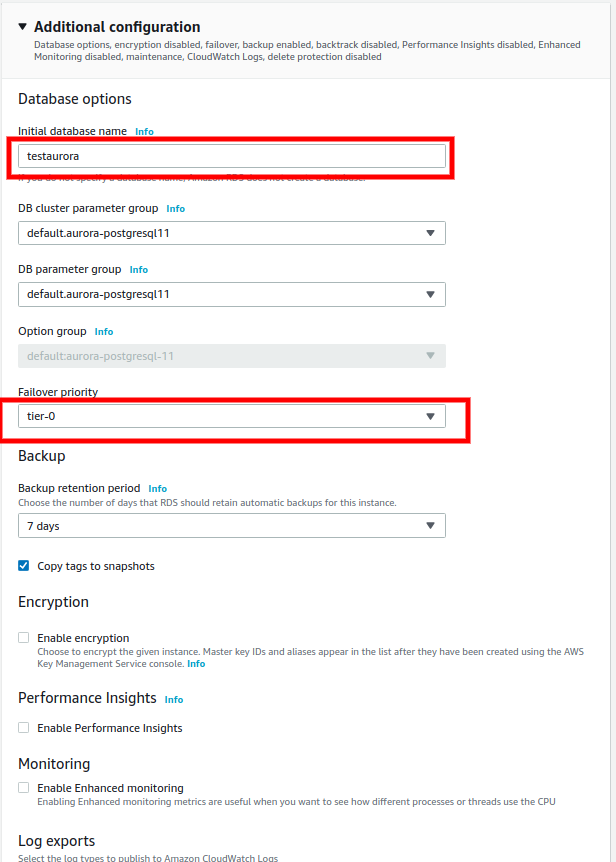

After create, we can add a read replica, selecting actions:


Select a name and the machine size:


And select priority and click on create:


The result:

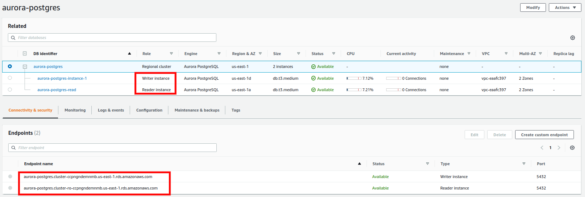


---
## References
- https://www.udemy.com/course/certificacao-amazon-aws-2019-solutions-architect
- https://aws.amazon.com/free